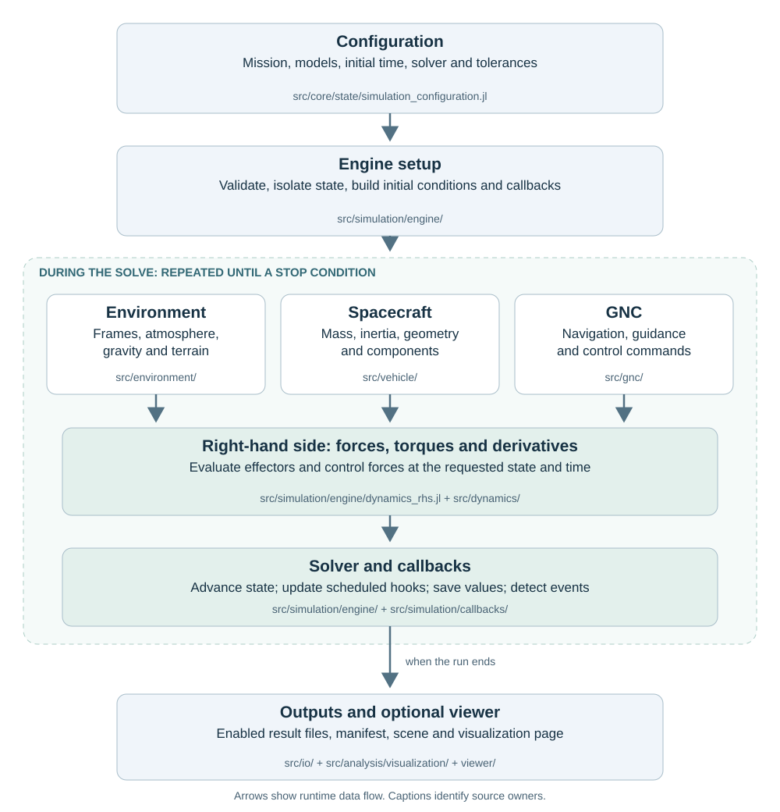

# Architecture and Responsibilities

Use this page when you want to know how a simulation flows from a
configuration to saved outputs, which folder and file owns each shared
operation, and where your own code belongs.

This page is for students and new contributors who can already run an example
and now need to find their way around the repository. It describes the code as
it is at commit
[`5ca4d327`](https://github.com/Space-FALCON-Lab/SpaceAGORA.jl/commit/5ca4d3274ee2b2b55ef41d1580aba9b4a66161f9)
of `main` (browse that tree at
[github.com/Space-FALCON-Lab/SpaceAGORA.jl/tree/5ca4d327](https://github.com/Space-FALCON-Lab/SpaceAGORA.jl/tree/5ca4d3274ee2b2b55ef41d1580aba9b4a66161f9));
every path below is relative to the repository root at that commit. Proposed
changes are labelled as proposals in the last section.

Shortest successful command:

```text
julia --project=. examples/AGORA_Basic_Quickstart.jl
```

What to read next:

- [Concepts](concepts.md) (operating modes and entry surfaces)
- [Simulation Configuration](simulation_configuration.md) (every configuration field)
- [The Integrated State](integrated_state.md) (what the solver integrates)
- [Simulation Outputs](outputs.md) (the files a run writes)
- [Extensibility](../extensibility.md) (the stable hook contract for new models)

## One picture of a run

A single run starts with a `SimulationConfiguration` handed to
`run_simulation`. Setup prepares the state and models. During the solve, the
engine repeatedly evaluates forces and torques, advances the state, and runs
scheduled or event callbacks. Control forces enter the right-hand side;
navigation, guidance and control-command updates use callbacks. Outputs are
saved along the way and assembled into files at the end.



The arrows show runtime data flow, not Julia module-loading dependencies. At the
module level, `SimulationModel` assembles the model types and hooks,
`SimulationEngine` owns preparation and propagation, and `SimulationCampaigns`
coordinates Monte Carlo and ensemble runs. `src/SpaceAGORA.jl` loads these
modules and exposes the supported public interface. The folder map below
identifies where their implementations live.

## Following one configuration through the code

Take the quickstart example. This is the path its configuration takes, with
the file that performs each step.

1. **The example builds a configuration.** `examples/AGORA_Basic_Quickstart.jl`
   loads `examples/common.jl`, which activates the project and imports
   `SpaceAGORA`. The configuration is a
   `SimulationConfiguration`
   whose fields are listed on the [configuration page](simulation_configuration.md).
   Studies that derive a variant from an existing configuration use
   `SimulationModel.SimConfig._with_configuration`, defined in the same file, so
   unchanged fields keep their references and model types are inferred again.
2. **`run_simulation` validates and prepares.** The root wrapper in
   `src/SpaceAGORA.jl` forwards the typed configuration to
   `src/simulation/engine/execution.jl`.
   Additional call wrappers, including the engine-configuration form, live in
   `src/simulation/engine/public_api.jl`.
   It aligns the density-model epoch, then deep-copies the configuration unless
   `isolate_state=false`, checks inertia, thermal and ephemerides support, builds
   initial conditions
   (`dynamics_rhs.jl`,
   `build_initial_conditions`), and allocates the shared buffers held in
   `ODEParams` (`src/core/types/runtime_types.jl`).
3. **Frames and geometry.** Inertial-to-planet-fixed conversions and their
   time-dependent SPICE variants are in
   `src/core/interfaces/reference_system.jl`
   (`r_intor_p!`, `r_pintor_i`); geodetic altitude and ellipsoid radius helpers
   are in `src/core/numerics/geodesy.jl`;
   planet constants and ephemerides models are under
   `src/environment/ephemerides/`.
4. **Atmosphere sampling.** Every density model answers `getDensity` (and the
   batched `getDensityBatch!`) in
   `src/environment/atmosphere/density_models.jl`.
   The analytic models live there; the surrogate grid model and named presets are
   in `gram_grid_atmosphere_model.jl`
   and `surrogate_presets.jl`;
   native GRAM integration and the fixed-grid adapter methods are provided by
   the package extension when both SpaceAGORA and `GRAMSuite` are loaded, through
   `ext/SpaceAGORAGRAMSuiteExt.jl`
   and `ext/gram_grid_atmosphere.jl`.
   The fixed-grid path needs the wrapper and a grid file, not native GRAM binaries.
   See [Atmosphere Models](atmosphere_models.md) for choosing one.
5. **Forces and torques.** The engine obtains the state and environment required by
   each effector and calls its `wrench` (or the compatibility
   `calcForceTorque`). The wrapper module and its models are under
   `src/dynamics/coupled/force_torque_models.jl`
   and the `force_torque_models/`
   folder (gravity, aerodynamics, perturbations, thrusters, plume, reaction
   wheels). These modules also include implementations from other owners, such
   as `src/environment/gravity/gravity_models.jl` and
   `src/dynamics/coupled/aerodynamic_mesh_surrogate.jl`. The hook contract is on the [Extensibility](../extensibility.md) page.
6. **Guidance, navigation and control.** The hooks are three modules:
   `src/gnc/guidance/guidance_hooks.jl`,
   `src/gnc/navigation/navigation_hooks.jl`
   and `src/gnc/control/control_hooks.jl`.
   Concrete algorithms sit in subfolders (`guidance/aerobraking`, `guidance/rpo`,
   `guidance/landing`, `control/rpo_mpc`, `control/aerobraking`), and the
   aerobraking strategy selector lives in
   `src/mission/operations/aerobraking_policy/`.
   Navigation and guidance hooks run as periodic callbacks between integrator
   steps; control commands are refreshed on periodic or event-driven schedules, and the
   resulting control force and torque are evaluated inside the right-hand side
   through `calcControlForceTorque`.
7. **Callbacks.** Save fields, density updates, thermal and plume updates, GNC
   dispatch, state anchors and stop conditions are registered from
   `src/simulation/callbacks/callbacks.jl`;
   `default_save_fields` is in `save_fields.jl`.
   See [Stopping on a Condition](stop_conditions.md).
8. **Propagation.** `spacecraft_dynamics!` in
   `dynamics_rhs.jl`
   assembles translational and rotational derivatives for every spacecraft;
   `solver_policy.jl`
   builds tolerances and chooses the integrator route from `SolverConfig`
   (see [Solver Configuration](solver_configuration.md)). Parallel routing of the
   effector work is decided in `src/parallel/`
   (see [Parallel Execution](parallel_execution.md)).
9. **Outputs.** After the solve,
   `persistence.jl`
   turns the saved values into a table and writes the enabled CSV, Feather and
   manifest outputs through `src/io/outputs/io_outputs.jl`
   and the atomic-write helpers in
   `src/io/serialization/io_serialization.jl`.
   With `visualization=true` the scene sidecar and viewer page are produced by
   `src/analysis/visualization/scene/`
   and the browser code under `viewer/`. See [Simulation Outputs](outputs.md).

## Map of the repository

Package implementation lives in `src/` and `ext/`. The GRAMSuite extension
activates when both packages are loaded; installation alone does not load it.
The other folders hold tooling, data, examples and documentation. "Owner" below is the
file or module that defines the behaviour; other code should call it rather
than copy it.

| Path | What it holds | Owner of the shared operation |
| --- | --- | --- |
| `src/SpaceAGORA.jl` | Includes the modules below in order and re-exports the public surface | the root package; the supported list is the generated [Public API](../generated/public_api.md) |
| `src/core/` | Abstract types, configuration structs, reference frames, geodesy, quaternions, runtime types | configuration creation and copying: `core/state/simulation_configuration.jl`; frames: `core/interfaces/reference_system.jl`; quaternions: `core/numerics/quaternion_utils.jl` |
| `src/environment/` | Planets and ephemerides, atmosphere models and presets, gravity fields, terrain grids | density sampling: `environment/atmosphere/density_models.jl`; terrain queries: `environment/terrain/terrain_models.jl` |
| `src/vehicle/` | Spacecraft components and assembly, structure and mass properties, mesh readers, thrusters, thermal models, kinematics, robotics | vehicle boundary per the [topology contract](../generated/contracts/architecture/canonical_topology_contract.md): `spacecraft/` composes, `structure/` computes mass, inertia and geometry, `actuators/thruster/thruster_hooks.jl` owns thruster hooks |
| `src/dynamics/` | Translational and rotational equations, the coupled force/torque wrapper and its models, cloth multibody dynamics | effector evaluation: `dynamics/coupled/force_torque_models.jl` |
| `src/gnc/` | Guidance, navigation and control hooks and the algorithms behind them | the three hook files named above; shared bridge helpers in `gnc/internal/` |
| `src/mission/` | Aerobraking policy types and strategy selection | `mission/operations/aerobraking_policy/` |
| `src/simulation/` | The engine (configuration types, setup, RHS, solver policy, execution, checkpoints, persistence), callbacks, campaigns, runtime locks | simulation setup and solve: `simulation/engine/`; callbacks: `simulation/callbacks/`; Monte Carlo and ensembles: `simulation/campaigns/`; shared locks: `simulation/runtime_services.jl` |
| `src/parallel/` | Parallel profiles and routing, cost models, worker process pools, in-process policy | route selection and process pools; owned by the parallelization work |
| `src/io/` | Configuration file loading, serialization helpers, output tables | output recording: `io/outputs/io_outputs.jl` |
| `src/analysis/` | Telemetry verification studies and example helpers, visualization scene and RPO plots | example helper builders: `analysis/verification/telemetry_verification/example_support.jl` |
| `src/assets/`, `src/cli/` | Asset lookup for RPO stations and the Odyssey surrogate; the `spaceagora` command | [CLI](../cli.md), [Assets & Modes](../assets.md) |
| `ext/` | The `GRAMSuite` extension: native GRAM density, SPICE-backed ephemerides, native-free fixed-grid adapter methods | activates when both packages are loaded; see [GRAMSuite Setup](gramsuite_setup.md) |
| `examples/` | Runnable scenarios; `common.jl` is the shared bootstrap | primary scenario entrypoints; development viewer demos also live in `scripts/dev/viewer_demos/`; see the [Examples Catalog](examples_catalog.md) |
| `templates/` | Starting files for a force/torque model, a density model and a control hook | copy one of these to begin an extension |
| `test/` | Unit, integration, smoke and stress suites, CI gates under `test/gates/`, contract checks under `test/contracts/`, review artifacts under `test/ai_reviews/` | the gates enforce the ownership rules on this page |
| `benchmarks/` | Performance studies and the paper pipeline (`benchmarks/scripts/performance_paper_pipeline.jl`) | measurement work owned by the parallelization effort; see [Studies and Benchmarks](studies_benchmarks.md) |
| `scripts/` | Operational tools: plotting (`scripts/plotting/`), telemetry fetching, GRAM installation helpers, development launchers (`scripts/dev/`), HPC and remote helpers | operational, not package code |
| `experimental/` | Typed scaffolds not loaded by the package (resources, laser terminal, constellation, estimation) | no stability guarantee; see its README |
| `viewer/` | The browser viewer and its build scripts | rendering only; the scene data comes from `src/analysis/visualization/scene/` |
| `data/` | Gravity and topography coefficients, references, asset manifests and the Odyssey surrogate manifest | see [Assets & Modes](../assets.md) |
| `docs/` | This site: user pages under `docs/src/`, maintainer contracts under `docs/architecture/` and `docs/quality/`, the public API registry | [Maintainer Overview](../maintainer/index.md) |

## Where your code belongs

Ask two questions: will other scenarios reuse it, and is it tested against a
contract? Reusable, tested capabilities go into the package; research-specific
algorithms stay outside it until they are.

**Put it in `src/` when** it is a general capability with a clear owner
folder above, it implements one of the stable hooks (`wrench`, `getDensity`,
guidance, navigation or control hooks, callbacks), it has unit tests under
`test/unit/`, and any new root export is registered in
`docs/public_api_symbols.jl`. Start from `templates/` and follow
[Extensibility](../extensibility.md). Do not copy an existing model into a
new file to change two lines; add a method or a configuration field to the
owner instead.

**Put it in `examples/` when** it is a runnable scenario that shows a
capability. Examples load `examples/common.jl`, build a configuration through
the package API, and never include package internals by relative path. A new
example is also the right place to demonstrate a new model before a tutorial
page exists.

**Put it in `benchmarks/studies/` or a research repository when** it is a
study driver, a parameter sweep, a comparison against another tool or an
algorithm you are still changing week to week. Keep its failure and retry
policy explicit in the script. Results, plots and reports belong in the
private results repository, not in this public tree.

For example, a reusable scheduling interface and the mechanism that executes
its commands can belong in the package after their API is agreed. A student's
particular scheduling objective, search algorithm and experiment belong in the
study or research repository. The current `src/mission/` folder contains
specific aerobraking policy code; its name does not imply that a general
scheduling API already exists.

**Put it in `experimental/` when** you are shaping an API for a subsystem that
does not run yet. It is not loaded by `using SpaceAGORA` and can contain
explicit not-implemented failures.

**Put it in `scripts/` when** it is an operational tool: fetching data,
installing native assets, plotting saved outputs, launching a batch on a
cluster. Existing viewer demonstration drivers live under
`scripts/dev/viewer_demos/` with their own README; extend that family there.
The older canonical-owner audit predates those development demos, so its
exclusive wording about example entrypoints is not a complete current inventory.

The CI gates check structural rules such as keeping runnable examples and
plotting scripts out of `src/` and avoiding relative includes of package
internals from examples. These checks do not prove every ownership or data
decision is correct. Keep restricted inputs and private research outputs out
of the public repository; review their provenance separately.

## Remaining cleanup

Status at commit `5ca4d327`. Each item states what is confirmed, what is
deliberate, and who is expected to act; the last sub-list is a proposal, not a
description of the current code.

**Confirmed cleanup targets:**

- Four examples redefine the package's constant-density atmosphere model and
  a fifth file carries an unused copy. Draft pull request
  [#164](https://github.com/Space-FALCON-Lab/SpaceAGORA.jl/pull/164) removes the
  five definitions and uses the shared model. Follow that PR for its current
  integration status.
- `scripts/dev/viewer_demos/cygnss_constellation.jl` builds a configuration by
  copying seven fields instead of calling `_with_configuration`. A candidate for
  the shared copy helper; its explicit DP8 solver, tolerances and scenario
  overrides must be preserved.
- `scripts/tb_matrix_debug_defs_only.jl` is a 2,331-line generated copy of
  definitions, and the debug launchers still call a removed
  `_run_gmat_scenario_matrix_result_once`. A supported definition-loading boundary
  would remove the copy and let the launchers use the current names.
- `benchmarks/studies/performance_static_vs_parallel.jl` includes a
  nonexistent sibling; the owner is `benchmarks/scripts/performance_paper_pipeline.jl`.
  Broken include, to be repaired with the parallelization owner.
- `scripts/dev/test_reorg_b1.sh` is a one-time migration that mutates Git and
  targets already-moved paths, with no live caller. Retirement candidate.

**Intentional similarities (keep):**

- Test fixtures that define their own small custom models, so the tests
  exercise user-defined-model handling rather than the package model.
- The canonical frame and quaternion files each have one production include;
  later subsystems that use different helpers are not automatically wrong.

**Further review and ownership decisions:**

- Robotics and cloth contain repeated quaternion helpers. Distinguish raw from
  normalized multiplication and check rotation conventions before deciding
  which definitions can share an owner. Their current duplication is not yet
  established as intentional or necessary.

- `scripts/plotting/plot_data.jl` still reads old dictionary and solution
  structures and is listed as a runnable owner. Check the replacement coverage for its
  costate and switching diagnostics with the legacy capability owner before
  retiring the entrypoint; similar modern plots are not sufficient evidence.
- The direct `Tables` dependency and the redundant `output/calibration/` ignore
  entry are cleanup candidates. A direct-dependency change needs manifest
  validation; transitive users of `Tables` must continue to resolve it.
- GRAM loading and benchmark adapters repeat across `examples/common.jl`,
  telemetry tools and study scripts, and `performance_runtime_analysis/main.jl`
  defines extension methods itself. A shared bootstrap needs agreement with the
  parallelization and surrogate owners first.
- `examples/aerobraking_mission_plot_utils.jl` mixes mission setup, event
  extraction, reference comparison and plotting in 1,870 lines with live
  consumers; splitting by responsibility is organization work, not a duplicate
  removal.

**Proposals (not implemented):**

- Move the responsibility table above into a CI-checked owner registry so the
  gates and this page cannot drift apart.
- Add a `templates/guidance_hook_template.jl` beside the existing control
  hook template, for students building a guidance model.
- Once #164 merges and the CYGNSS migration lands, refresh the relevant cleanup entries.
  Repeat the definition scan when later changes justify it.
